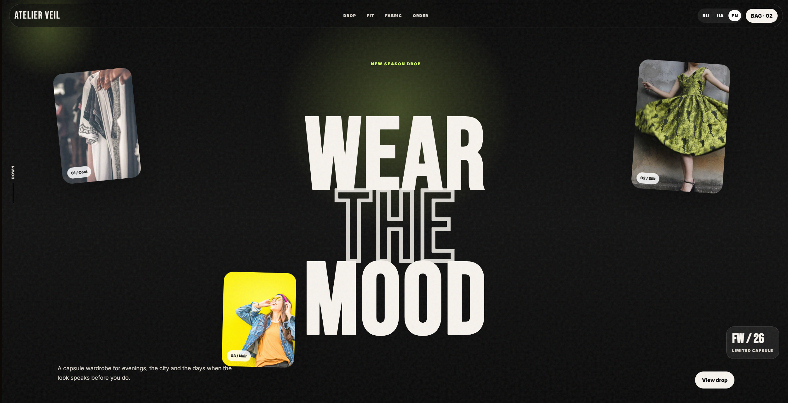
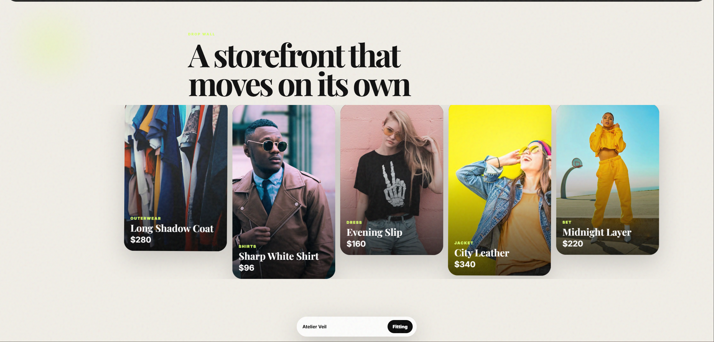
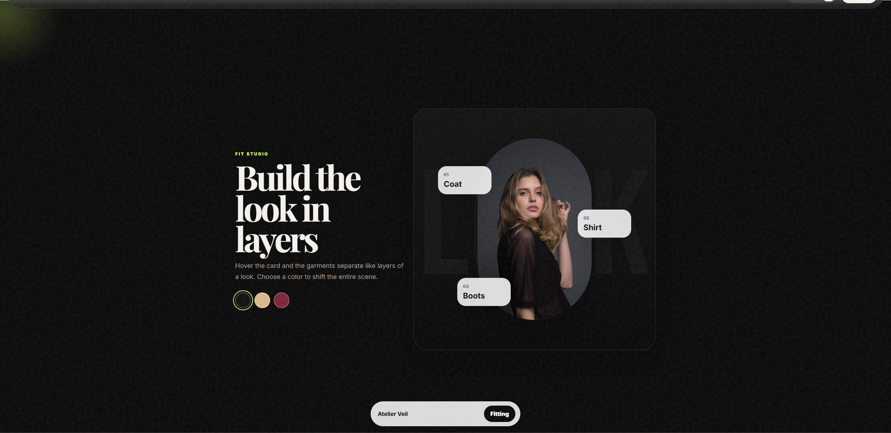

# 🧥 Atelier Veil — Fashion Drop Landing

**Atelier Veil** is a frontend landing page made with plain HTML, CSS and JavaScript.

A static fashion landing page for a capsule clothing drop with a product wall, layered outfit section and clean editorial layout.

---

## 🌐 Live Demo

👉 [Open Live Demo](https://lendingi-kp4n0ot17-eruweb.vercel.app)

---

## ✅ Features

- ✔ Fashion drop hero section.
- ✔ Product wall.
- ✔ Layered outfit / fit studio block.
- ✔ Color mood interaction.
- ✔ Language switcher.
- ✔ Responsive static layout.
---

## 🛠️ Tech Stack

- **HTML5**
- **CSS3**
- **JavaScript**
- **Responsive layout**
- **No frontend framework**

---

## 📸 Screenshots

### Home Page

### Drop Wall

### Fit Studio

---

## 🚀 Getting Started

Open `index.html` in a browser.

You can also run it with a simple local server

---

## ⚠️ Notes

This is a static concept landing page.  
Forms and buttons are visual/demo elements unless connected to a backend later.
