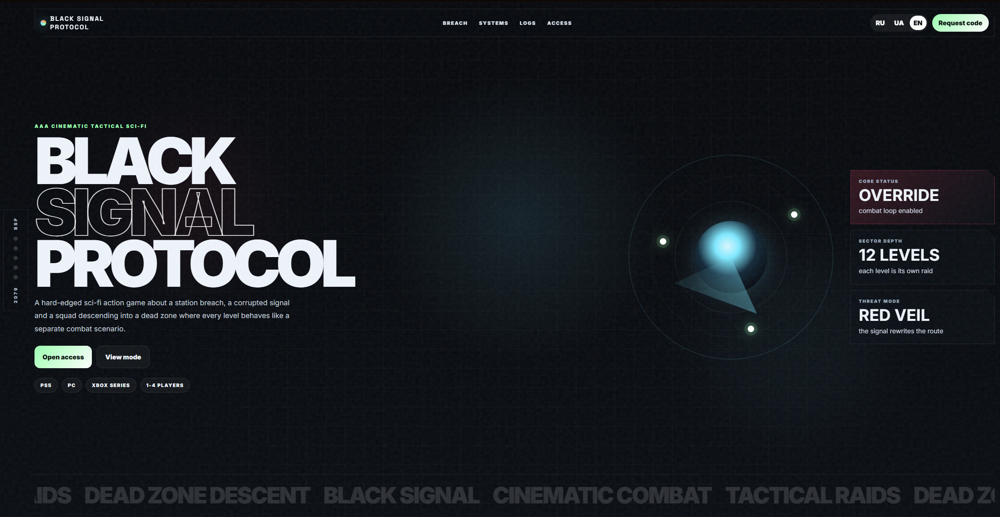
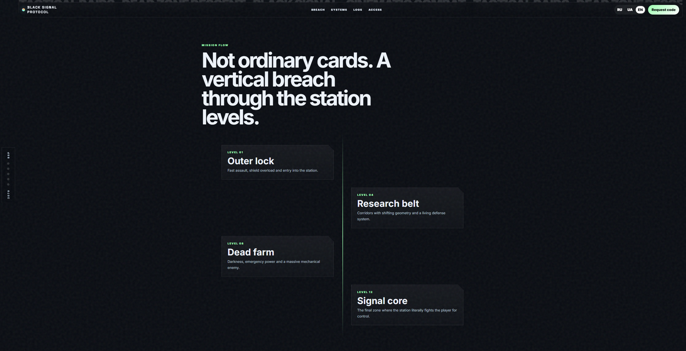
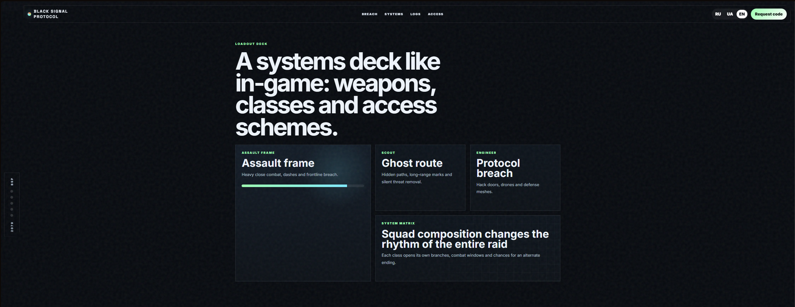
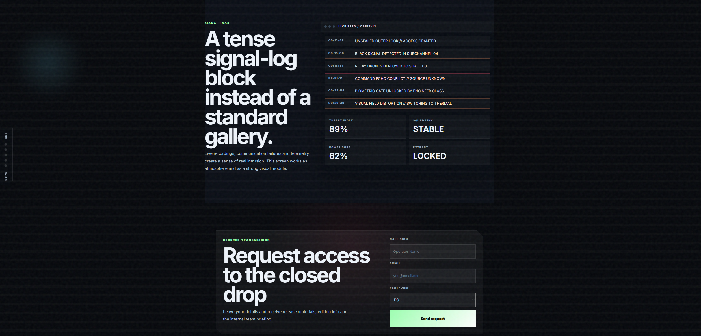

# 🛰️ Black Signal Protocol — Cinematic Tactical Sci‑Fi Landing

**Black Signal Protocol** is a frontend landing page made with plain HTML, CSS and JavaScript.

A static sci‑fi landing page with a dark tactical interface, mission blocks, animated UI details and a console-like visual style.

---

## 🌐 Live Demo

👉 [Open Live Demo](https://your-demo-link.vercel.app)

---

## ✅ Features

- ✔️ Cinematic hero section with sci‑fi atmosphere.
- ✔️ Mission and level blocks for a game-style presentation.
- ✔️ Animated cursor glow and scroll reveal effects.
- ✔️ Language switcher.
- ✔️ Responsive layout.
- ✔️ Plain HTML, CSS and JavaScript.

---

## 🛠️ Tech Stack

- **HTML5**
- **CSS3**
- **JavaScript**
- **Responsive layout**
- **No frontend framework**

---

## 📸 Screenshots

### Home Page



### Protocol Section



### Systems Section



### Access Section


---

## 📁 Project Structure

```text
.
├── index.html
├── style.css
├── script.js
├── README.md
└── assets/
    └── screenshots/
        ├── home.png
        ├── protocol.png
        ├── systems.png
        └── access.png
```

---

## 🚀 Getting Started

Open `index.html` in a browser.

You can also run it with a simple local server


---


## ⚠️ Notes

This is a static concept landing page.  
Forms and buttons are visual/demo elements unless connected to a backend later.
