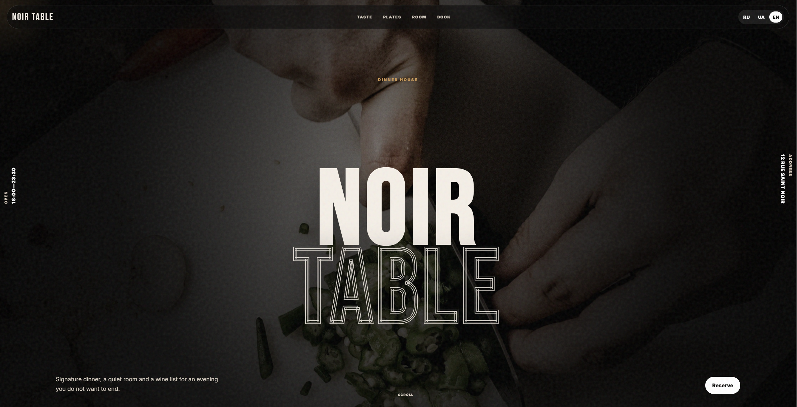
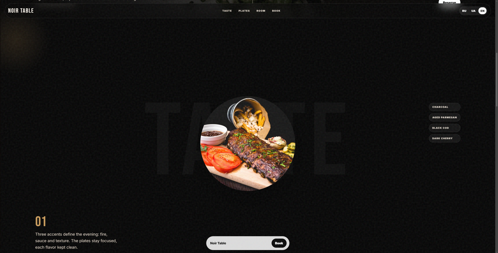
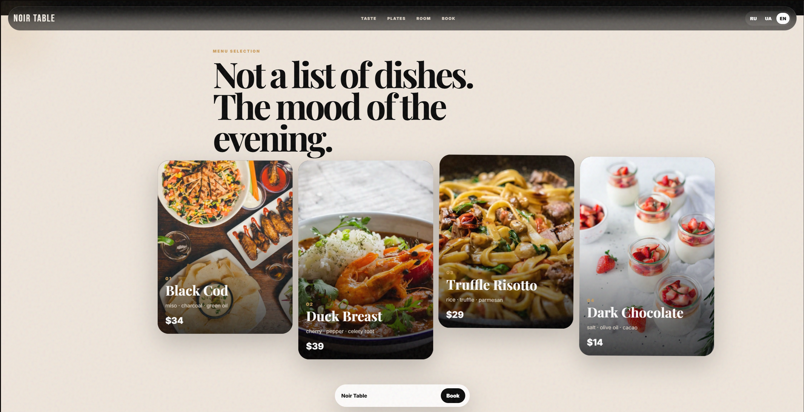
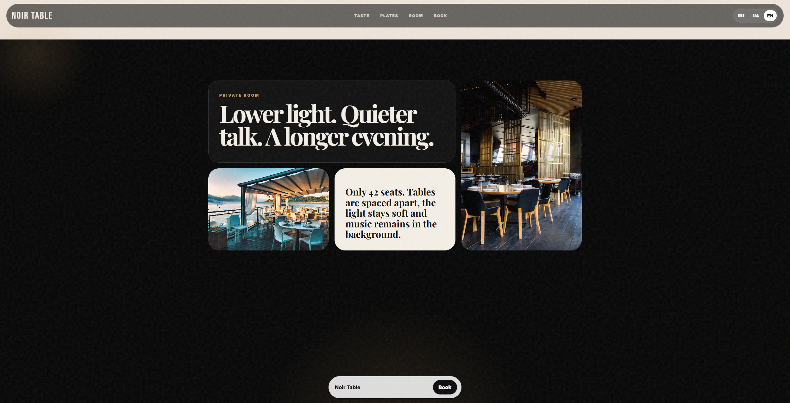
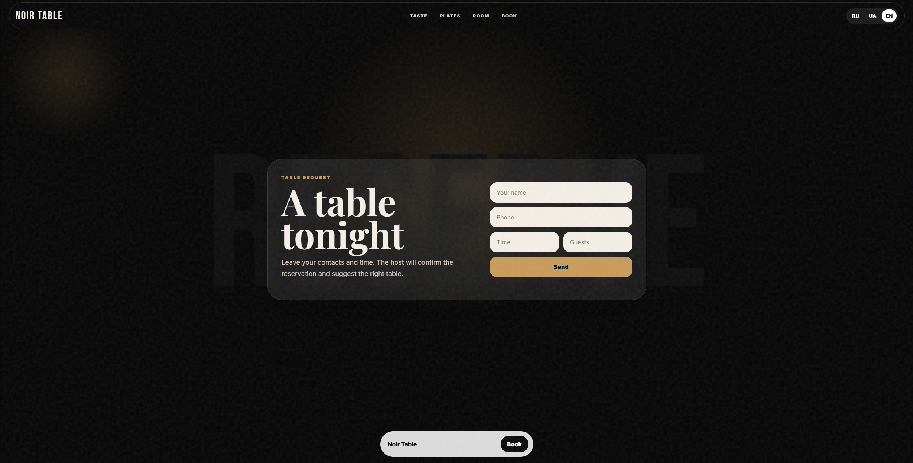

# 🍷 Noir Table — Restaurant Landing Page

**Noir Table** is a frontend landing page made with plain HTML, CSS and JavaScript.

A dark editorial restaurant landing page with menu highlights, private-room atmosphere and reservation-focused layout.

---

## 🌐 Live Demo

👉 [Open Live Demo](https://your-demo-link.vercel.app)


---

## ✅ Features

- ✔️ Restaurant hero section.
- ✔️ Menu selection blocks.
- ✔️ Private room / atmosphere section.
- ✔️ Reservation-oriented layout.
- ✔️ Language switcher.
- ✔️ Responsive static implementation.

---

## 🛠️ Tech Stack

- **HTML5**
- **CSS3**
- **JavaScript**
- **Responsive layout**
- **No frontend framework**

---

## 📸 Screenshots
### Home Page



### About Section



### Menu Section



### Private Room Section



### Reservation Section


---
---
## 📁 Project Structure

```text
noir-table/
├── index.html
├── style.css
├── script.js
├── README.md
└── assets/
    └── screenshots/
        ├── home.png
        ├── about.png
        ├── menu.png
        ├── private-room.png
        └── reservation.png
```

---

## 🚀 Getting Started

Open `index.html` in a browser.


---

## ⚠️ Notes

This is a static concept landing page.  
Forms and buttons are visual/demo elements unless connected to a backend later.
