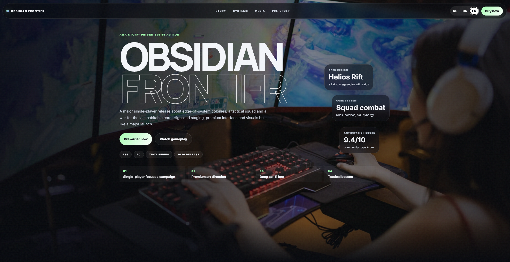
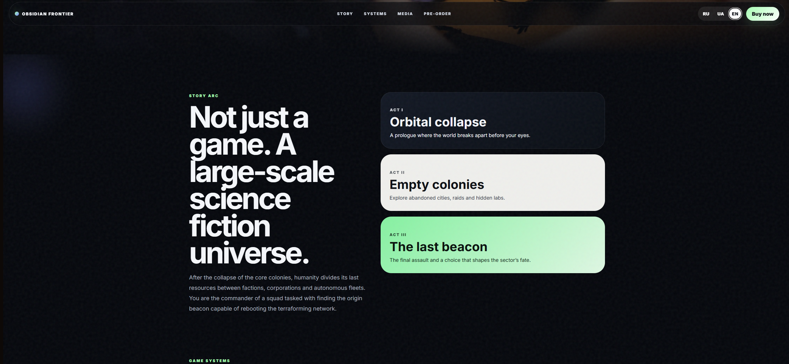
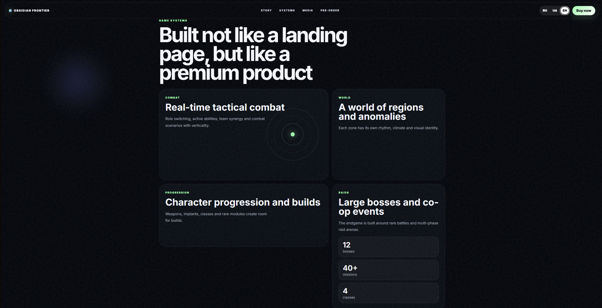
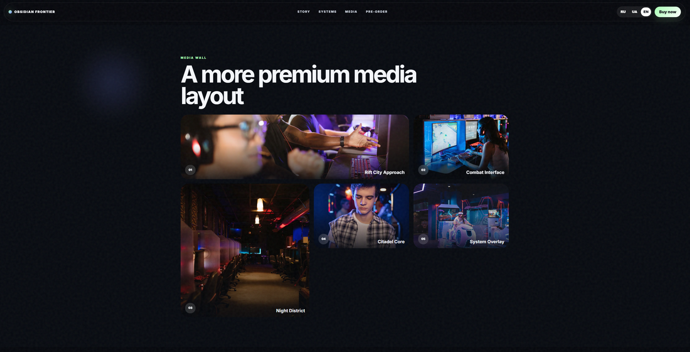
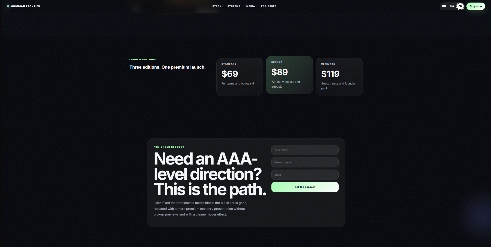

# 🚀 Obsidian Frontier — AAA Sci‑Fi Game Landing

**Obsidian Frontier** is a frontend landing page made with plain HTML, CSS and JavaScript.

A static landing page concept for a story-driven sci‑fi action game with hero presentation, story acts, game systems and pre-order style sections.

---

## 🌐 Live Demo

👉 [Open Live Demo](https://lendingi-ek6k.vercel.app)


---

## ✅ Features

- ✔️ AAA game-style hero section.
- ✔️ Story arc presentation.
- ✔️ Game systems blocks.
- ✔️ Animated reveal effects.
- ✔️ Language switcher.
- ✔️ Responsive static layout.

---

## 🛠️ Tech Stack

- **HTML5**
- **CSS3**
- **JavaScript**
- **Responsive layout**
- **No frontend framework**

---

## 📸 Screenshots


### Home Page



### Story Section



### Systems Section



### Media Section



### Early Access Section


---

## 📁 Project Structure

```text
.
├── index.html
├── style.css
├── script.js
├── README.md
└── assets/
    └── screenshots/
        ├── home.png
        ├── story.png
        └── systems.png
```

---

## 🚀 Getting Started

Open `index.html` in a browser.

You can also run it with a simple local server


---

## ⚠️ Notes

This is a static concept landing page.  
Forms and buttons are visual/demo elements unless connected to a backend later.
